# Codeial

A simple web application for chatting and posting your thoughts. 

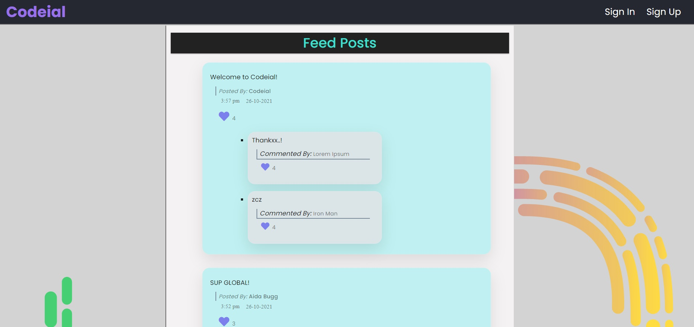


### Built With

* [Node.js](https://nodejs.org/en/)
* [Express.js](https://expressjs.com/)
* [ejs](https://ejs.co/)  
* [MongoDB](https://www.mongodb.com/)  


### Pogram features

* Login SignUp / Login Sign Up Using **Google**
  * 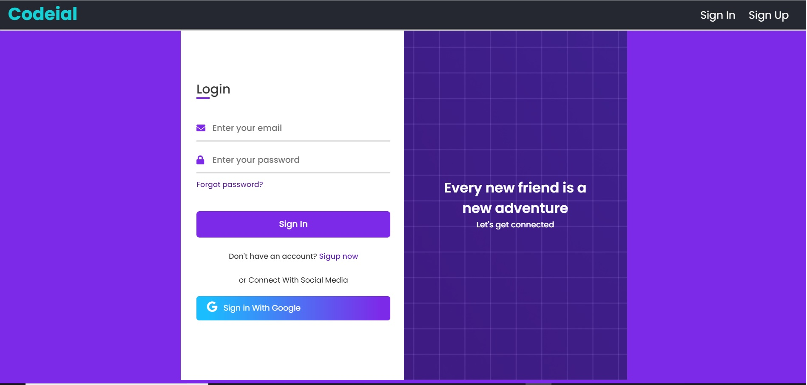
  * 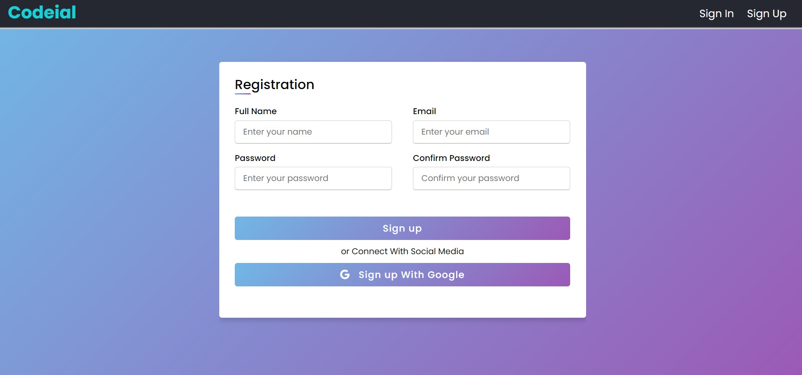
  * 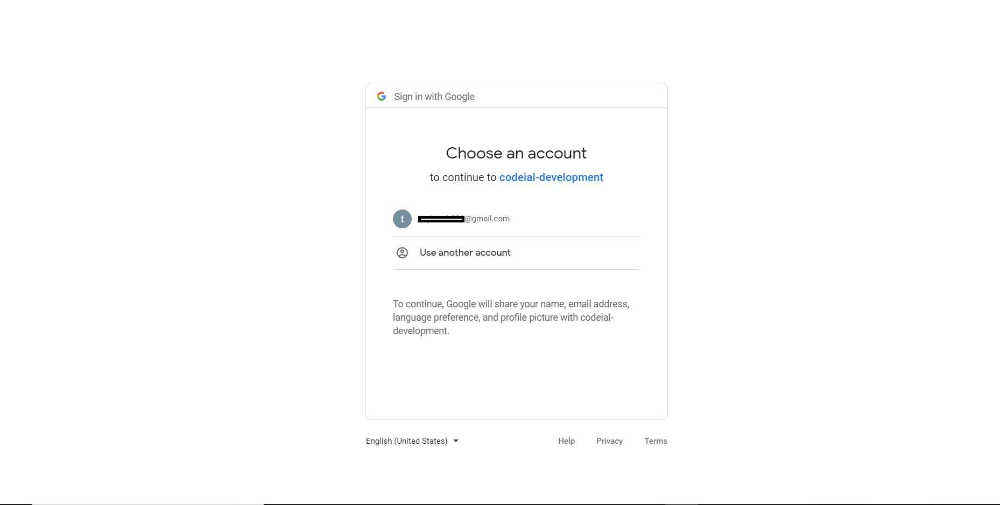

* Home Page - where you can create/like and comment a post. Naviage around using left naigation bar.
  * 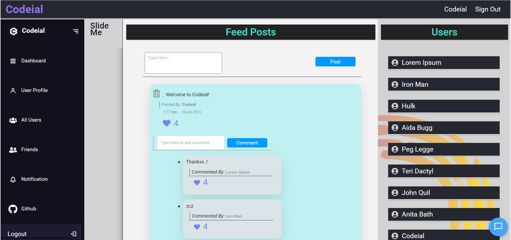

* Chat Box - Real-Time chat with other Online Users.
  * 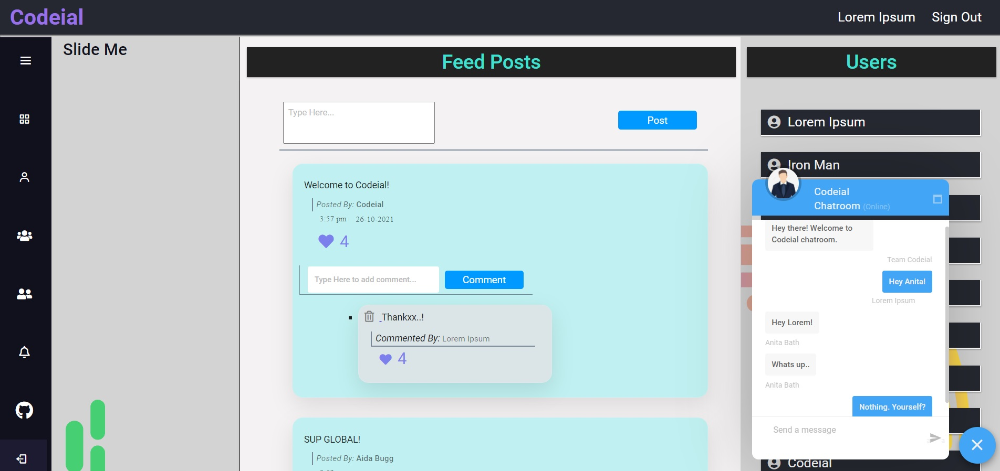
  * 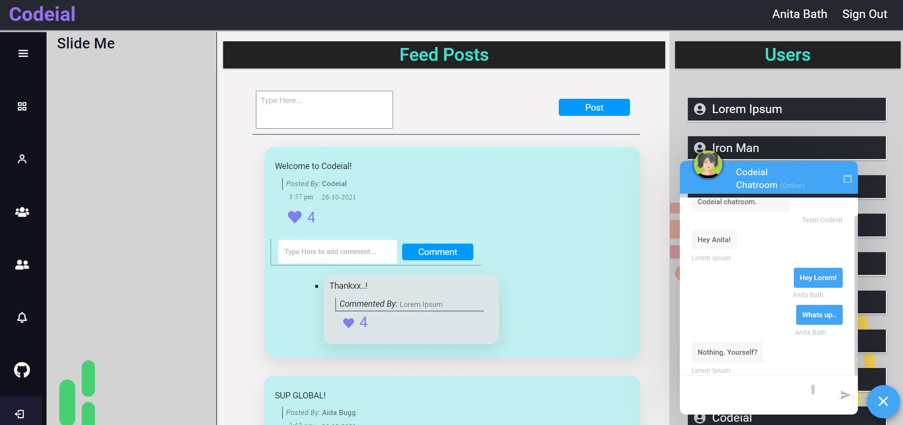

* Profile - You can add/remove friends
  * 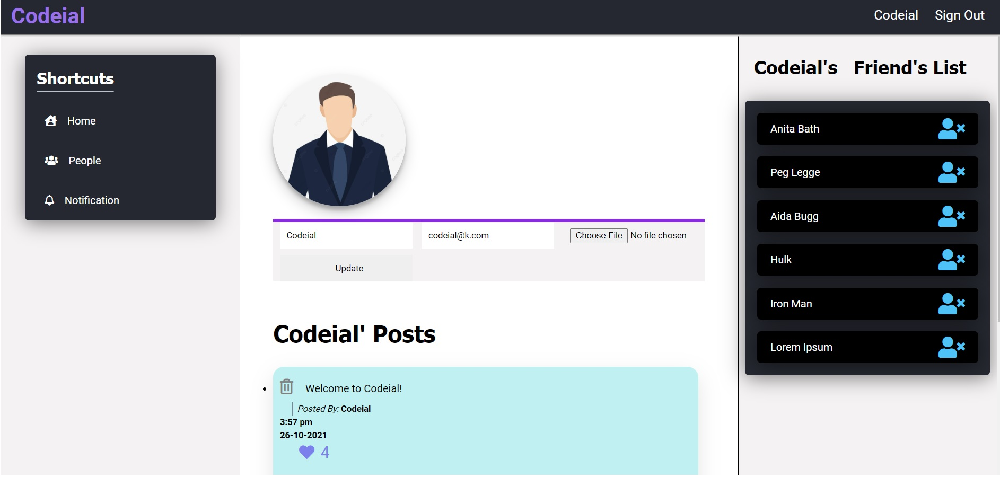
  * 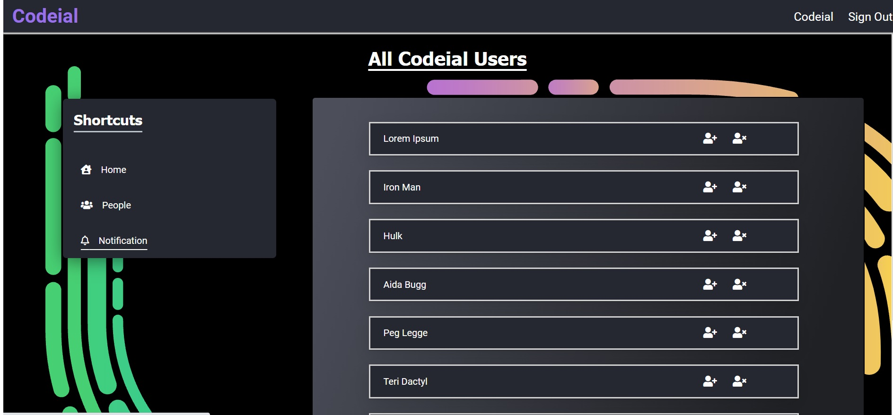

* Notifications - you will get notified when 
  * Someone likes you Post
  * Someone likes you Comment
  * You likes You own Post
  * You likes You own Comment
  
  * 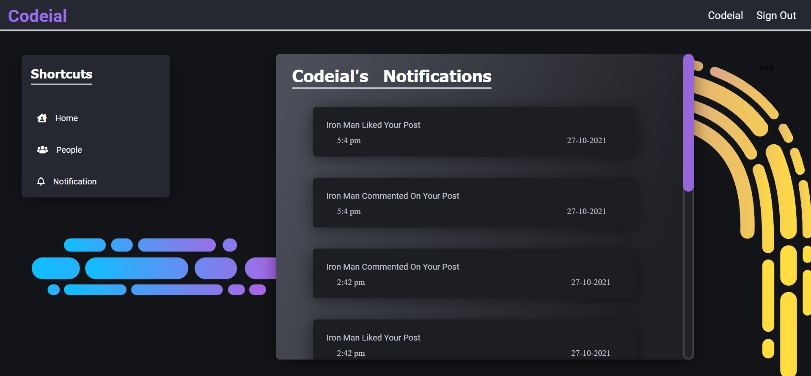


* Emails - You will be updated by email if 
  * You create a post
  * You delete a post
  * You create a comment
  * You delete a comment
  * Someone likes your Post/Comment.
  
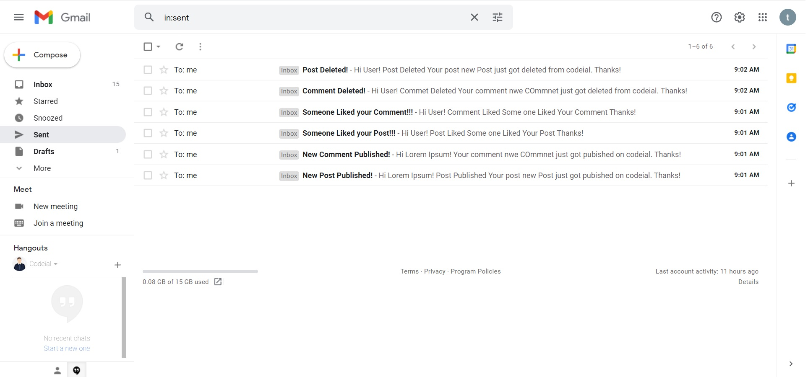

* Forgot Password - If you forgot your password 
  *You will get a email on your registered email address if your account exist in our Database.
    * 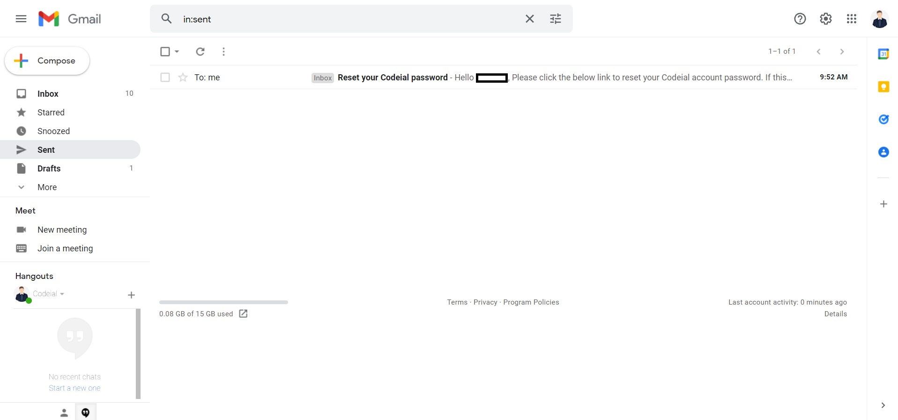
    

### Dependencies

```
npm install
```

### Executing program

```
npm run
```


## Authors

[Kunal](https://github.com/Kunal1358)

